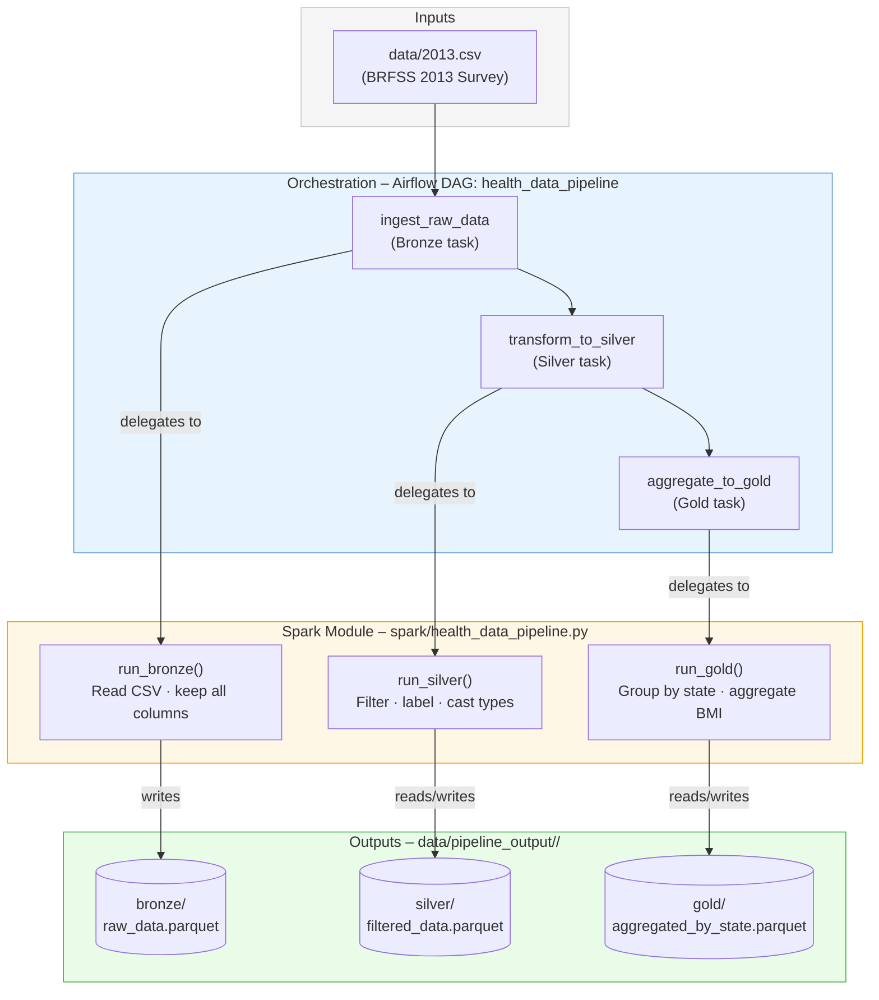

# Health Data Pipeline

Processes the [BRFSS 2013 health survey](https://www.cdc.gov/brfss/) CSV through a **Bronze → Silver → Gold** medallion architecture using **Apache Spark** for processing and **Apache Airflow** for orchestration.

---

## Architecture



---

## Pipeline Layers

| Layer  | Task               | Spark function   | Output path                                    | What happens                                       |
|--------|--------------------|------------------|------------------------------------------------|----------------------------------------------------|
| Bronze | `ingest_raw_data`  | `run_bronze()`   | `bronze/raw_data.parquet`                      | Raw CSV ingested as-is; no schema changes          |
| Silver | `transform_to_silver` | `run_silver()` | `silver/filtered_data.parquet`               | Invalid rows dropped; columns cleaned and labelled |
| Gold   | `aggregate_to_gold` | `run_gold()`    | `gold/aggregated_by_state.parquet`             | BMI aggregated by US state for analytics           |

Each DAG run writes its output under `data/pipeline_output/<run_id>/` so runs are isolated and **idempotent** — re-running the same DAG run safely overwrites its own output without touching other runs.

---

## Repository Structure

```
airflow/
├── dags/
│   └── health_data_pipeline_dag.py   # Airflow DAG – thin orchestration only
├── spark/
│   ├── __init__.py
│   └── health_data_pipeline.py       # Spark pipeline – single entry point
├── data/
│   └── 2013.csv                      # Source data (BRFSS 2013)
├── pipeline_flow.md                  # Mermaid diagram source
└── README.md                         # This file
```

---

## Running the Pipeline

### Standalone (no Airflow required)

```bash
# Run with defaults (reads data/2013.csv, writes to data/pipeline_output/)
python spark/health_data_pipeline.py

# Run with custom paths
python spark/health_data_pipeline.py \
  --input data/2013.csv \
  --output-dir data/pipeline_output
```

### Via Airflow

```bash
# Start the Airflow server
airflow standalone

# Trigger the DAG
airflow dags trigger health_data_pipeline
```

---

## Silver Layer – Transformations

| Source column | Output column            | Transformation                                  |
|---------------|--------------------------|-------------------------------------------------|
| `_STATE`      | `State_Code`             | Kept as-is                                      |
| `GENHLTH`     | `General_Health`         | 1–5 mapped to Excellent/Very Good/Good/Fair/Poor; other values dropped |
| `_BMI5`       | `BMI_Value`              | Divided by 100 (stored as ×100 int); null/zero rows dropped |
| `_TOTINDA`    | `Physical_Activity_Status` | 1 → Active, 2 → Inactive, other → Unknown     |
| `_AGEG5YR`    | `Age_Group_Code`         | Kept as-is                                      |
| `_RACE`       | `Race_Code`              | Kept as-is                                      |
