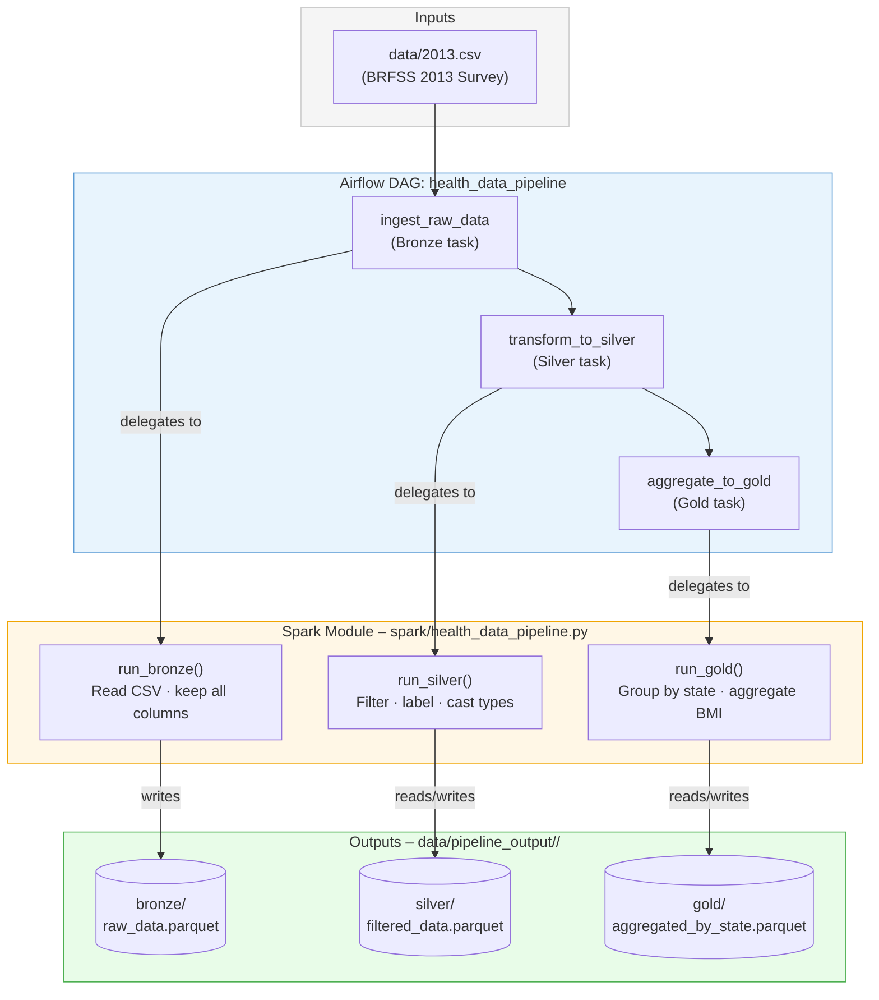
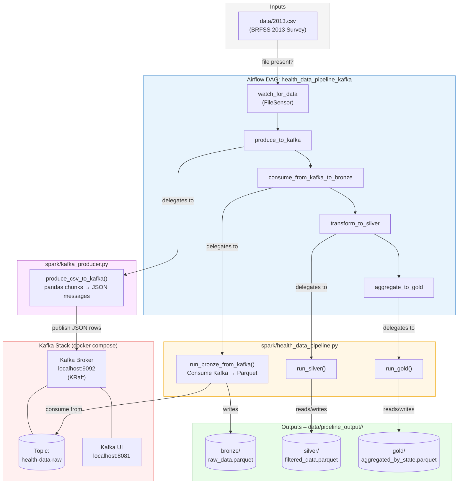

# Health Data Pipeline

Processes the [BRFSS 2013 health survey](https://www.cdc.gov/brfss/) CSV through a **Bronze → Silver → Gold** medallion architecture using **Apache Spark** for processing and **Apache Airflow** for orchestration.

---

## Prerequisites

Libraries defined in `requirements.txt` + **Java 17** + **Docker** (for the Kafka stack)

### Setup

```bash
# 1. Clone the repo and enter its directory
git clone <repo-url>

# 2. Create and activate a virtual environment
python -m venv venv
source venv/bin/activate          # Windows: venv\Scripts\activate

# 3. Install Python dependencies
pip install -r requirements.txt

# 4. Download the source data (see "Source Data" section below)

# 5. (Optional) Start the local Kafka stack
docker compose up -d
```

---

## Source Data

The pipeline expects the **BRFSS 2013 Behavioral Risk Factor Surveillance System** dataset at `data/2013.csv`.

1. Go to the Kaggle dataset page:
   **<https://www.kaggle.com/datasets/cdc/behavioral-risk-factor-surveillance-system?select=2013.csv>**
2. Click **Download** (requires a free Kaggle account) and select `2013.csv`, or download the full dataset and extract `2013.csv`.
3. Place the file at `data/2013.csv` inside the project root.

> The file is ~1 GB. `data/` is gitignored so it is never committed.

---

## Architecture

Two ingestion paths share the same Silver and Gold processing logic.

### Path A — Direct CSV (original)



### Path B — Kafka Queue (new)



---

## Pipeline Layers

| Layer  | Task                          | Spark function            | Output path                        | What happens                                       |
|--------|-------------------------------|---------------------------|------------------------------------|----------------------------------------------------|
| Bronze | `ingest_raw_data`             | `run_bronze()`            | `bronze/raw_data.parquet`          | Raw CSV ingested as-is; no schema changes          |
| Bronze | `consume_from_kafka_to_bronze`| `run_bronze_from_kafka()` | `bronze/raw_data.parquet`          | Kafka messages consumed and written as Parquet     |
| Silver | `transform_to_silver`         | `run_silver()`            | `silver/filtered_data.parquet`     | Invalid rows dropped; columns cleaned and labelled |
| Gold   | `aggregate_to_gold`           | `run_gold()`              | `gold/aggregated_by_state.parquet` | BMI aggregated by US state for analytics           |

Each DAG run writes its output under `data/pipeline_output/<run_id>/` so runs are isolated and **idempotent** — re-running the same DAG run safely overwrites its own output without touching other runs.

---

## Running the Pipeline

### Standalone (no Airflow required)

```bash
# Run with defaults (reads data/2013.csv, writes to data/pipeline_output/)
python spark/health_data_pipeline.py

# Run with custom paths
python spark/health_data_pipeline.py \
  --input data/2013.csv \
  --output-dir data/pipeline_output
```

### Via Airflow – Direct CSV path (original DAG)

```bash
# Start the Airflow server
airflow standalone

# Trigger the DAG
airflow dags trigger health_data_pipeline
```

### Via Airflow – Kafka path (new DAG)

```bash
# 1. Start local Kafka (KRaft mode, no Zookeeper)
docker compose up -d

# Kafka UI is available at http://localhost:8081

# 2. Start the Airflow server (if not already running)
airflow standalone

# 3. Trigger the Kafka DAG
airflow dags trigger health_data_pipeline_kafka
```
