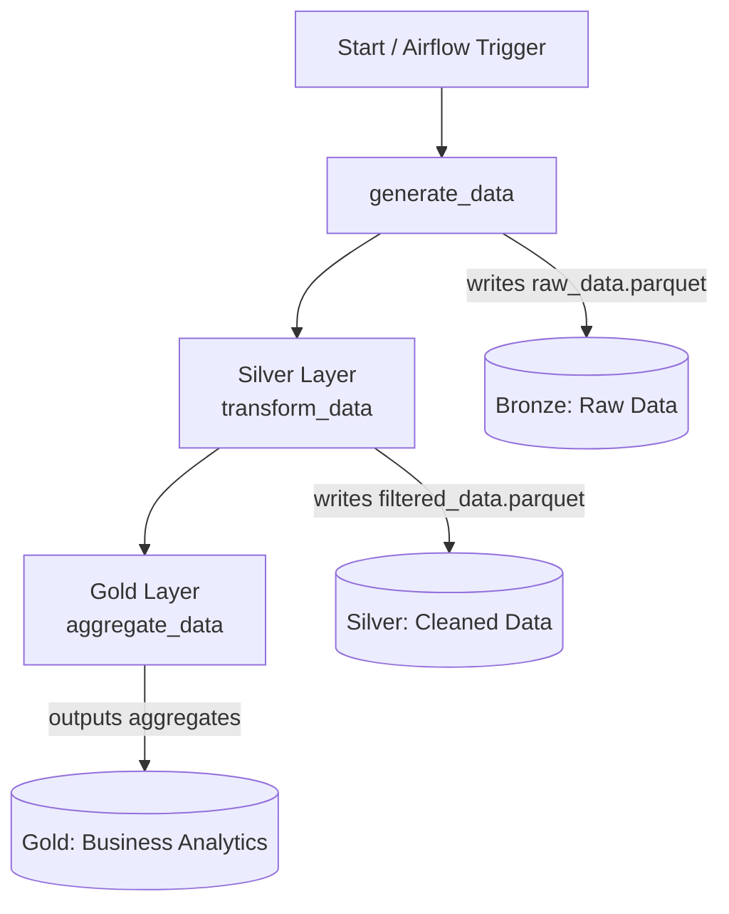

```mermaid
flowchart TD
    A[Start / Airflow Trigger] --> B[generate_data]
    B --> C["Silver Layer<br/>transform_data"]
    C --> D["Gold Layer<br/>aggregate_data"]
    
    B -->|writes raw_data.parquet| E[(Bronze: Raw Data)]
    C -->|writes filtered_data.parquet| F[(Silver: Cleaned Data)]
    D -->|outputs aggregates| G[(Gold: Business Analytics)]
```