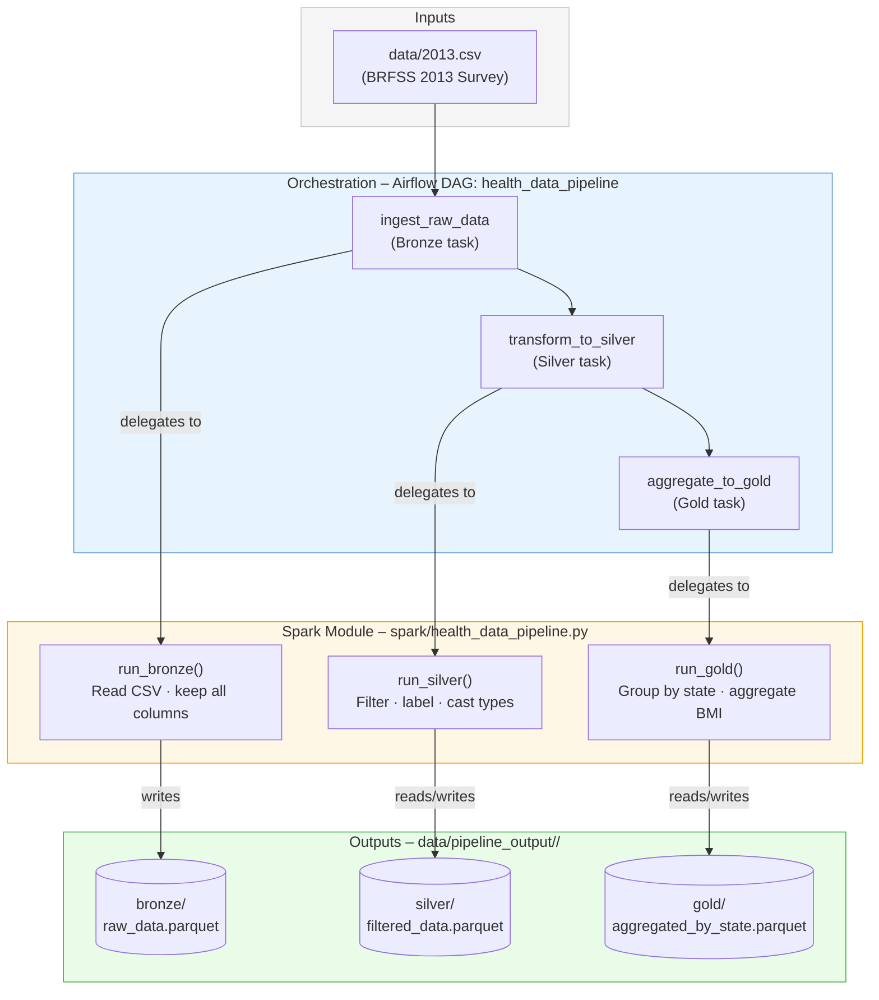

```mermaid
flowchart TD
    subgraph inputs["Inputs"]
        CSV["data/2013.csv<br/>(BRFSS 2013 Survey)"]
    end

    subgraph orchestration["Orchestration – Airflow DAG: health_data_pipeline"]
        T1["ingest_raw_data<br/>(Bronze task)"]
        T2["transform_to_silver<br/>(Silver task)"]
        T3["aggregate_to_gold<br/>(Gold task)"]
        T1 --> T2 --> T3
    end

    subgraph spark_module["Spark Module – spark/health_data_pipeline.py"]
        S1["run_bronze()<br/>Read CSV · keep all columns"]
        S2["run_silver()<br/>Filter · label · cast types"]
        S3["run_gold()<br/>Group by state · aggregate BMI"]
    end

    subgraph storage["Outputs – data/pipeline_output/<run_id>/"]
        B[("bronze/<br/>raw_data.parquet")]
        SL[("silver/<br/>filtered_data.parquet")]
        G[("gold/<br/>aggregated_by_state.parquet")]
    end

    CSV --> T1
    T1 -- "delegates to" --> S1
    T2 -- "delegates to" --> S2
    T3 -- "delegates to" --> S3
    S1 -- "writes" --> B
    S2 -- "reads/writes" --> SL
    S3 -- "reads/writes" --> G

    style inputs fill:#f5f5f5,stroke:#ccc
    style orchestration fill:#e8f4fd,stroke:#5b9bd5
    style spark_module fill:#fff7e6,stroke:#f0a500
    style storage fill:#e8fce8,stroke:#4caf50
```