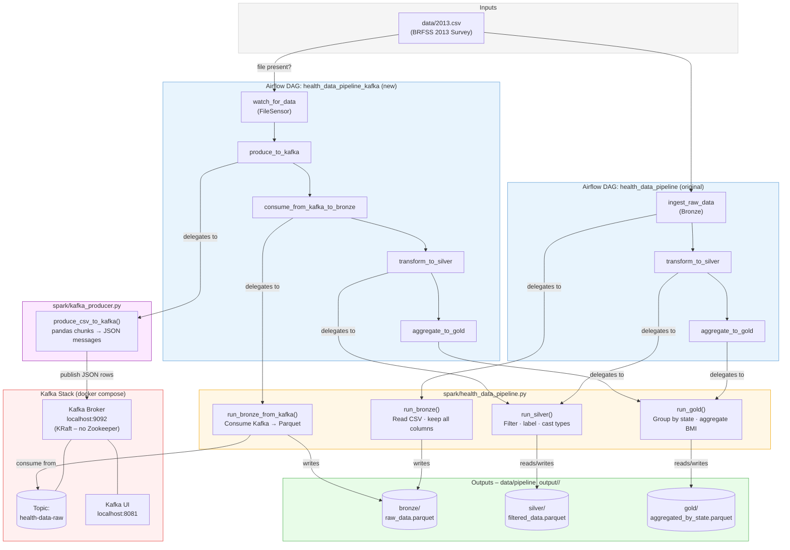

```mermaid
flowchart TD
    subgraph inputs["Inputs"]
        CSV["data/2013.csv<br/>(BRFSS 2013 Survey)"]
    end

    subgraph kafka_stack["Kafka Stack (docker compose)"]
        BROKER["Kafka Broker<br/>localhost:9092<br/>(KRaft – no Zookeeper)"]
        TOPIC[("Topic:<br/>health-data-raw")]
        UI["Kafka UI<br/>localhost:8081"]
        BROKER --- TOPIC
        BROKER --- UI
    end

    subgraph dag_direct["Airflow DAG: health_data_pipeline (original)"]
        T1["ingest_raw_data<br/>(Bronze)"]
        T2_d["transform_to_silver"]
        T3_d["aggregate_to_gold"]
        T1 --> T2_d --> T3_d
    end

    subgraph dag_kafka["Airflow DAG: health_data_pipeline_kafka (new)"]
        FS["watch_for_data<br/>(FileSensor)"]
        P["produce_to_kafka"]
        C["consume_from_kafka_to_bronze"]
        T2_k["transform_to_silver"]
        T3_k["aggregate_to_gold"]
        FS --> P --> C --> T2_k --> T3_k
    end

    subgraph spark_module["spark/health_data_pipeline.py"]
        S1["run_bronze()<br/>Read CSV · keep all columns"]
        S1K["run_bronze_from_kafka()<br/>Consume Kafka → Parquet"]
        S2["run_silver()<br/>Filter · label · cast types"]
        S3["run_gold()<br/>Group by state · aggregate BMI"]
    end

    subgraph producer_module["spark/kafka_producer.py"]
        PROD["produce_csv_to_kafka()<br/>pandas chunks → JSON messages"]
    end

    subgraph storage["Outputs – data/pipeline_output/<run_id>/"]
        B[("bronze/<br/>raw_data.parquet")]
        SL[("silver/<br/>filtered_data.parquet")]
        G[("gold/<br/>aggregated_by_state.parquet")]
    end

    %% Direct path
    CSV --> T1
    T1 -- "delegates to" --> S1
    T2_d -- "delegates to" --> S2
    T3_d -- "delegates to" --> S3

    %% Kafka path
    CSV -- "file present?" --> FS
    P -- "delegates to" --> PROD
    PROD -- "publish JSON rows" --> BROKER
    C -- "delegates to" --> S1K
    S1K -- "consume from" --> TOPIC
    T2_k -- "delegates to" --> S2
    T3_k -- "delegates to" --> S3

    %% Shared writes
    S1 -- "writes" --> B
    S1K -- "writes" --> B
    S2 -- "reads/writes" --> SL
    S3 -- "reads/writes" --> G

    style inputs fill:#f5f5f5,stroke:#ccc
    style kafka_stack fill:#fff0f0,stroke:#e53935
    style dag_direct fill:#e8f4fd,stroke:#5b9bd5
    style dag_kafka fill:#e8f4fd,stroke:#5b9bd5
    style spark_module fill:#fff7e6,stroke:#f0a500
    style producer_module fill:#fce8ff,stroke:#9c27b0
    style storage fill:#e8fce8,stroke:#4caf50
```